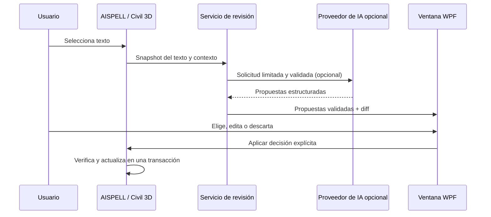

# CivilSpellAI: blueprint del asistente de revisión técnica

> Documento de visión. Incluye capacidades objetivo como edición manual y
> memoria local que no forman parte del MVP actual. Consultar
> `10_MVP_STATUS_AND_TEST_PLAN.md` para el estado implementado.

## 1. Decisión de producto

CivilSpellAI ya exige confirmación antes de modificar texto. Evolucionará esa
revisión básica hacia un asistente para anotaciones de Civil 3D: analiza un texto
seleccionado, propone alternativas técnicamente conservadoras y permite que el
profesional elija o descarte cada solución antes de que el dibujo cambie.

La autoridad sobre el contenido del plano siempre permanece en el usuario. La
IA recomienda; nunca aplica cambios por su cuenta.

## 2. Problema que resuelve

Las anotaciones de planos combinan español e inglés, abreviaturas, estaciones,
cotas, códigos, nombres de superficies y terminología propia de Civil 3D. Un
corrector genérico puede "mejorar" una palabra técnica y dañar el significado de
ingeniería. El producto debe mejorar la redacción sin cambiar datos técnicos ni
ocultar la decisión de corrección.

## 3. Experiencia objetivo

1. El usuario ejecuta `AISPELL` y selecciona un `DBText` o `MText`.
2. El complemento toma una copia inmutable del texto y de su contexto técnico.
3. El motor local genera una propuesta segura; si la IA está configurada y el
   usuario autorizó el envío, el proveedor de IA genera entre una y tres
   alternativas adicionales.
4. La ventana WPF muestra el texto original, las alternativas, un diff legible,
   los motivos de cada cambio y las advertencias técnicas.
5. El usuario puede elegir una alternativa, conservar el original o editar el
   resultado manualmente. Puede marcar una decisión como preferencia recordable.
6. Solo al pulsar **Aplicar** se abre una transacción corta de AutoCAD, se
   verifica que el objeto no cambió durante la revisión y se actualiza el texto.
7. La decisión aprobada se guarda localmente para mejorar futuras sugerencias.

Una ventana modal WPF es la primera interfaz integrada. Es más segura que una
paleta no modal mientras se define el ciclo de vida de documentos y
transacciones. Una `PaletteSet` puede evaluarse después, sin cambiar el núcleo.

## 4. Principios no negociables

- **Humano en el circuito.** No habrá aplicación automática de propuestas de IA.
- **Conservación técnica.** Números, unidades, coordenadas, estaciones, códigos,
  nombres protegidos y términos del glosario no pueden cambiar silenciosamente.
- **Explicabilidad.** Cada alternativa tendrá diff y una explicación breve; el
  texto que se escriba será exactamente el que el usuario ve y acepta.
- **IA opcional y degradación segura.** Sin red, clave o respuesta válida, el
  corrector local sigue disponible y el dibujo no se modifica.
- **Aprendizaje controlado.** Se recuerdan decisiones locales aprobadas, no se
  reentrena un modelo ni se comparten datos automáticamente.
- **Aislamiento de AutoCAD.** Los modelos y servicios de corrección no dependen
  de Autodesk; solamente los adaptadores leen y escriben entidades.

## 5. Qué significa "aprender"

En la primera versión, aprender no significa entrenar un LLM después de cada
clic. Significa construir una memoria local, auditable y reversible de:

- términos añadidos o protegidos por el usuario;
- reemplazos que el usuario aprobó repetidamente;
- propuestas que el usuario rechazó;
- idioma y perfil de redacción preferido, cuando el usuario lo indique.

La memoria solo mejora la prioridad o el contexto de propuestas futuras. Todas
las correcciones siguen apareciendo en la GUI y requieren aprobación. El usuario
puede revisar, editar, exportar o borrar su memoria desde la configuración.

## 6. Proveedor de IA

La arquitectura admite un proveedor LLM remoto con salida JSON estructurada. La
selección comercial concreta del proveedor se hará en el hito de integración,
considerando coste, disponibilidad regional, contrato de datos y credenciales
de la organización. El núcleo solo conoce la interfaz
`ITextCorrectionProvider`; nunca SDK, URL, clave ni modelo concretos.

La solicitud remota contendrá únicamente el texto seleccionado, idioma,
glosario técnico pertinente y preferencias explícitas. No se enviará el DWG
completo, adjuntos ni telemetría por defecto. Antes de la primera solicitud el
usuario debe aceptar el envío de texto a ese proveedor.

## 7. Medida de éxito de la primera entrega

La primera entrega con IA será satisfactoria si un usuario puede revisar una
anotación de Civil 3D de punta a punta, elegir entre propuestas válidas, aplicar
una sola versión de forma reversible mediante el undo nativo y comprobar por qué
se hizo cada modificación. Además, una respuesta inválida, una cancelación o una
falla de red no deben modificar ningún objeto del dibujo.
