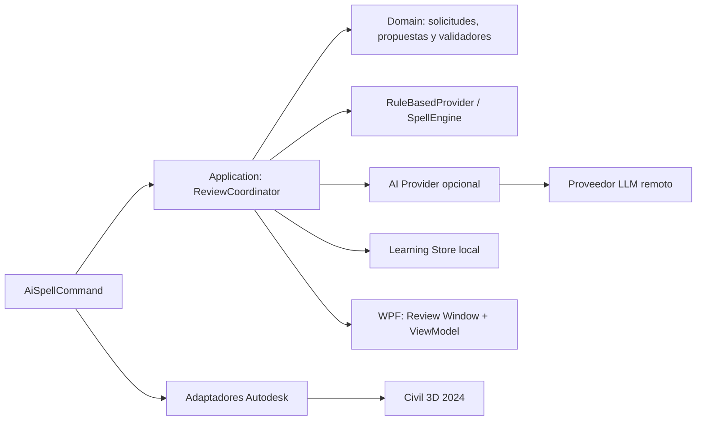

# Arquitectura y datos de CivilSpellAI

> Documento de arquitectura objetivo. La memoria, edición manual, glosario
> organizacional y almacén seguro de credenciales todavía son evoluciones. El
> MVP usa `OPENAI_API_KEY` y su arquitectura efectiva se resume en
> `10_MVP_STATUS_AND_TEST_PLAN.md`.

## 1. Arquitectura objetivo

La regla actual se conserva como proveedor local. La nueva arquitectura añade
una capa de aplicación, proveedores intercambiables y UI, sin introducir
dependencias de Autodesk en el dominio.



Reglas de dependencia:

- `Domain` no referencia AutoCAD, WPF, disco, red ni un SDK de IA.
- `Application` orquesta interfaces del dominio y no mantiene entidades de
  AutoCAD abiertas durante una operación asíncrona.
- `Autodesk` es el único lugar que conoce `ObjectId`, transacciones y tipos
  `DBText`/`MText`.
- `UI` solo consume modelos de presentación y comandos de aplicación.
- La infraestructura implementa configuración, almacenamiento local y el
  proveedor remoto detrás de interfaces.

## 2. Flujo seguro con Civil 3D

1. `SelectionHelper` devuelve un `TextSnapshot`: `ObjectId`, handle, texto
   original, tipo de entidad y huella del documento.
2. La transacción de lectura termina antes de abrir la GUI o consultar red.
3. `ReviewCoordinator` obtiene, combina y valida las propuestas.
4. La ventana devuelve una `ReviewDecision`, o cancelación.
5. Al aplicar, un adaptador abre una nueva transacción de escritura, relee el
   objeto y compara su contenido con `TextSnapshot.OriginalText`.
6. Si hay conflicto, no escribe: informa al usuario y solicita una nueva
   revisión. Si coincide, escribe el texto elegido y hace `Commit`.

El `Commit` de esta única transacción queda disponible como una operación de undo
nativa de AutoCAD. No se abrirán transacciones mientras la ventana espere al
usuario ni mientras haya una petición de red activa.

## 3. Contratos del dominio

Los nombres son una guía de implementación; las interfaces se crearán primero
en un proyecto/carpeta sin referencias Autodesk.

| Contrato | Responsabilidad |
| --- | --- |
| `CorrectionRequest` | Texto, idioma, contexto, glosario, restricciones y máximo de alternativas. |
| `CorrectionProposal` | Texto propuesto, origen, explicación, cambios calculados y advertencias. |
| `ReviewDecision` | Propuesta elegida, edición manual o conservación del original; nunca una acción implícita. |
| `ITextCorrectionProvider` | Genera propuestas; será implementado por reglas locales y por IA remota. |
| `IProposalValidator` | Recalcula el diff y bloquea cambios que violen las restricciones técnicas. |
| `ITechnicalGlossary` | Expone términos integrados, de archivo y de usuario. |
| `ILearningStore` | Guarda y consulta decisiones locales aprobadas y preferencias. |
| `IReviewCoordinator` | Compone proveedores, memoria, validación y estados de la revisión. |

La forma mínima de la integración asíncrona será:

```csharp
Task<IReadOnlyList<CorrectionProposal>> ProposeAsync(
    CorrectionRequest request,
    CancellationToken cancellationToken);
```

La interfaz no expone tipos de un proveedor específico. La versión local puede
devolver de inmediato una sola propuesta de `SpellEngine`; la IA puede devolver
hasta tres alternativas o ninguna.

## 4. Propuesta, diff y validación

Una propuesta no se considera confiable porque la generó una IA. Antes de
mostrarla se aplican estas validaciones:

1. La respuesta debe respetar el esquema estructurado esperado y tener entre una
   y tres alternativas.
2. El texto corregido debe ser distinto solo si existen cambios reales; el diff
   se calcula localmente, no se acepta el diff declarado por la IA.
3. Los tokens protegidos deben conservarse: números, unidades configuradas,
   códigos, coordenadas, estaciones, nombres del glosario y cadenas técnicas.
4. No se permiten invenciones, eliminación de datos ni cambios de objeto de
   ingeniería. Si el validador no puede comprobar algo, marca la propuesta como
   bloqueada y no habilita **Aplicar**.
5. Las explicaciones se muestran como ayuda, pero no son una fuente de verdad.

El proveedor recibe una instrucción de corrección conservadora y datos separados
del texto a revisar. También se limita tamaño de entrada, tiempo de espera y
número de reintentos. El contenido de una anotación se trata como datos, nunca
como instrucciones para el sistema.

## 5. La interfaz WPF

La ventana modal contiene:

- texto original no editable;
- lista de alternativas, incluyendo **Mantener original**;
- diff por palabra o segmento y explicación corta;
- etiquetas de origen: `Reglas locales`, `IA` o `Preferencia aprendida`;
- advertencias técnicas y estado de validación;
- edición manual opcional, que también pasa por el validador;
- acciones **Aplicar**, **Cancelar** y **Recordar esta preferencia**.

El ViewModel no abre transacciones ni llama directamente a AutoCAD. Su estado
incluye carga, ausencia de IA, error recuperable, propuesta bloqueada,
cancelación y conflicto de documento.

## 6. Glosario y memoria de aprendizaje

El glosario tendrá tres niveles, unidos sin duplicados y comparados sin
distinguir mayúsculas:

1. integrado con el producto (Civil 3D y términos de ingeniería comunes);
2. archivo administrado por la organización/proyecto;
3. términos personales aprobados por el usuario.

`ILearningStore` se guarda por usuario de Windows, en una ubicación de datos de
aplicación, con formato versionado. Cada registro contiene versión, texto de
origen normalizado, decisión normalizada, idioma, etiquetas de contexto,
contadores de aceptación/rechazo y fecha de uso. No guarda una contraseña ni
requiere una base de datos para la primera versión.

Las decisiones aprendidas sirven para proponer y ordenar alternativas, no para
reemplazar automáticamente el contenido. El usuario podrá eliminar registros y
desactivar el aprendizaje.

## 7. Configuración, privacidad y observabilidad

- La IA está desactivada hasta que se configure un proveedor y se otorgue
  consentimiento para enviar el texto seleccionado.
- Las credenciales se protegen mediante el almacén seguro de Windows o DPAPI;
  nunca se escriben en `technical-glossary.txt`, el DWG, código fuente o logs.
- No se guarda ni transmite el plano completo. Los registros locales no incluyen
  texto por defecto; solo diagnósticos técnicos y códigos de error.
- Un timeout, credencial inválida, respuesta malformada o falta de red ofrece
  reglas locales y no modifica el dibujo.
- El usuario podrá ver qué proveedor está configurado y borrar configuración y
  memoria local.

## 8. Estructura sugerida

```text
Commands/                 Punto de entrada AISPELL
Autodesk/                 Lectura, snapshot y escritura de entidades
Application/              ReviewCoordinator y casos de uso
Domain/                   Modelos, interfaces, reglas y validadores
Infrastructure/           Configuración, memoria y proveedor remoto
Spell/                    Adaptador temporal y motor de reglas existente
UI/                       WPF, ViewModels y recursos
Tests/                    Unitarias, integración de flujo y contratos
Resources/                Glosario integrado y plantillas
```

Durante la migración se puede mantener `SpellEngine` en `Spell/` y exponerlo a
través de `RuleBasedCorrectionProvider`. El comando `AISPELL` conserva el flujo
selección -> corrección -> edición, pero inserta la decisión de revisión antes de
escribir.
